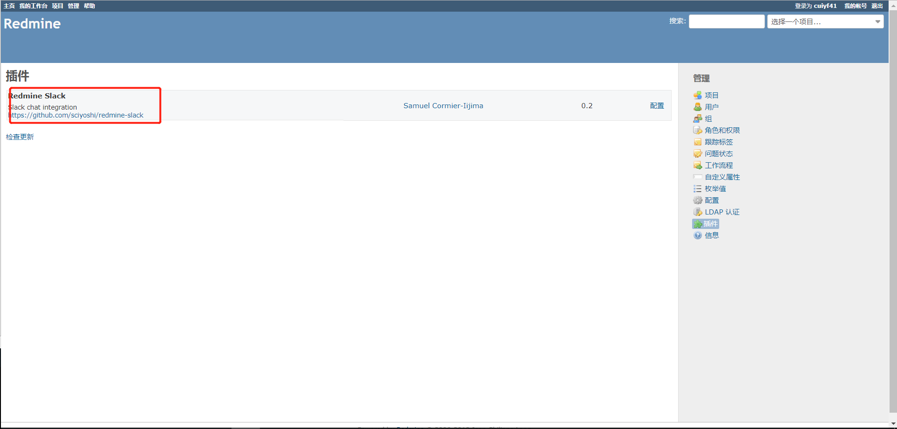
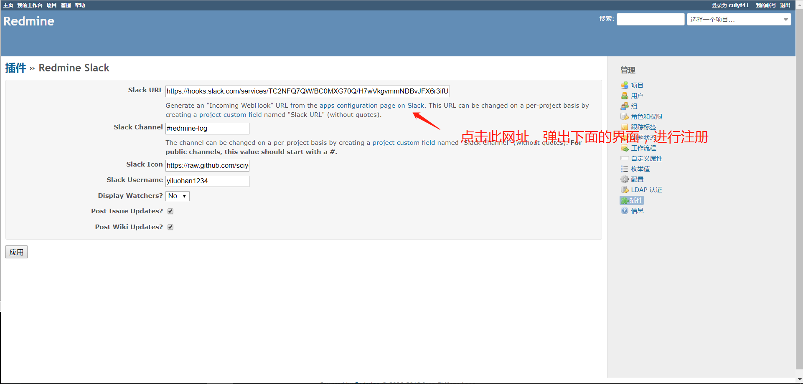
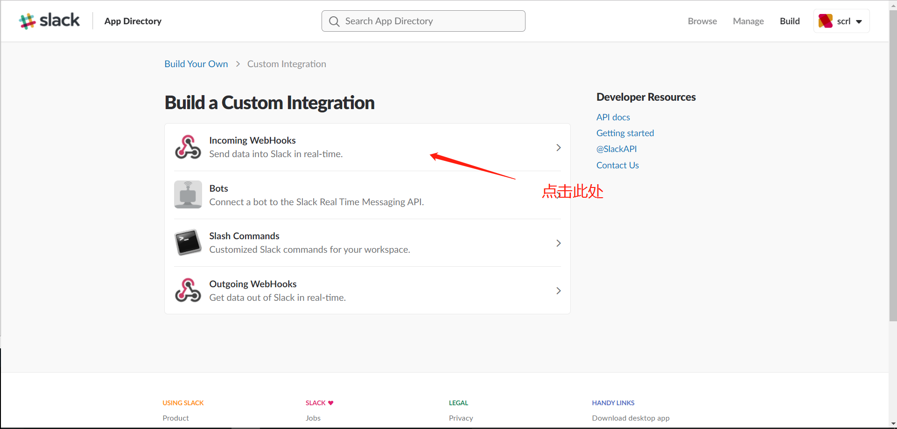
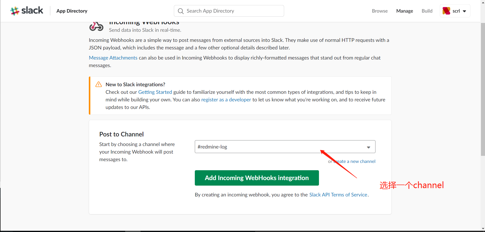
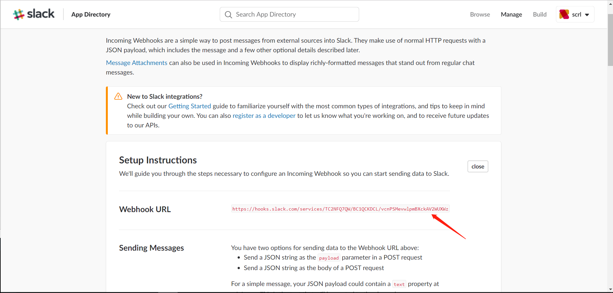
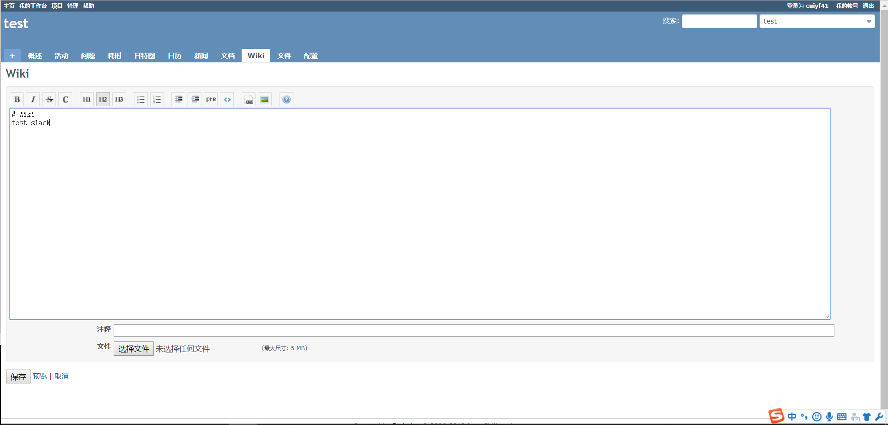
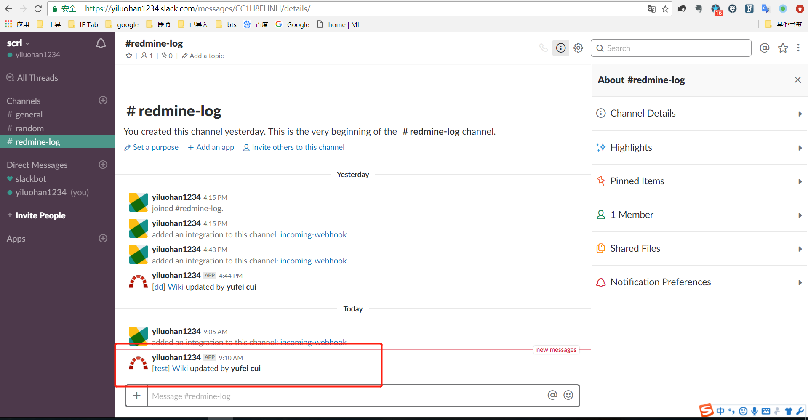
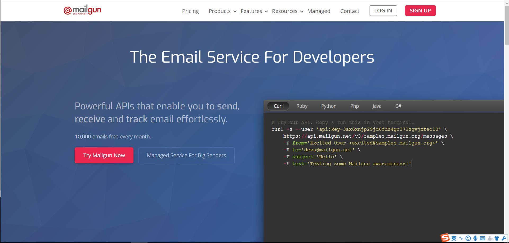
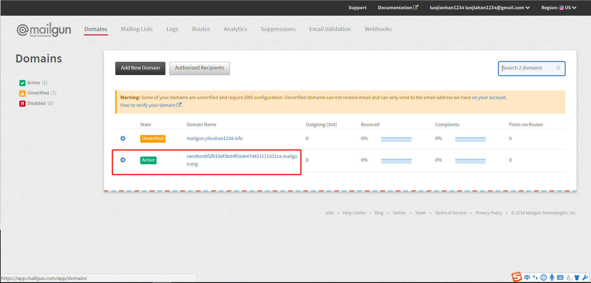
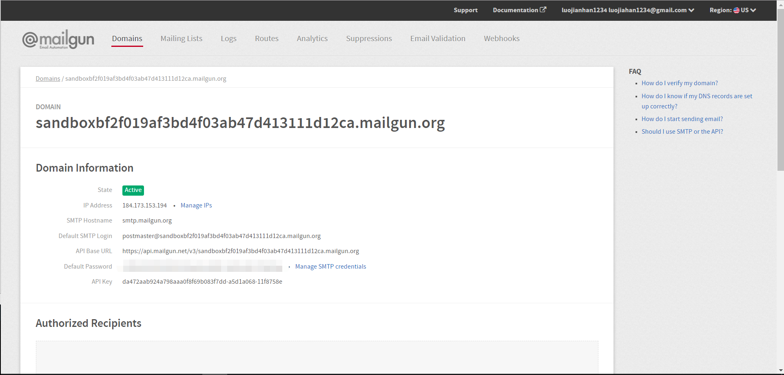

# heroku 部署redmine3.4
## 环境
- centos7
- ruby2.4.4
- bundler1.15.2
- redmine3.4

## 一、安装依赖

### 1.安装一些依赖包
```shell
yum -y install gcc mysql-devel ruby-devel rubygems libxml2 postgresql-devel ImageMagick ImageMagick-devel sqlite-devel git
```

### 2.[rvm](http://rvm.io/) 安装ruby2.4.4(为了后续 heroku 部署，需要和 heroku 上边的版本一致，防止出现问题)
```shell
gpg --keyserver hkp://keys.gnupg.net --recv-keys 409B6B1796C275462A1703113804BB82D39DC0E3 7D2BAF1CF37B13E2069D6956105BD0E739499BDB
curl -sSL https://get.rvm.io | bash -s stable
```
运行以下命令加载rvm环境
```shell
source /etc/profile.d/rvm.sh
rvm reload
```
验证依赖关系
```shell
rvm requirements run
```
安装Ruby 2.4.4
```shell
rvm install 2.4.4
```

bundler安装，bundler的版本也要和 heroku 上的版本一致。
```
gem uninstall bundler
gem install bundler -v 1.15.2
```
3.安装heroku工具
百度网盘[下载](https://pan.baidu.com/s/1hEJioeB5XpXZIMYdVKtX4Q)工具包

解压
```shell
tar -zxvf heroku-linux-x64.tar.gz -C /usr/local/
```

/etc/profile文件，添加环境变量
```shell
# heroku environment
export HEROKU_HOME=/usr/local/heroku
export PATH=${HEROKU_HOME}/bin:$PATH
```
##  二、heroku 部署redmine3.4
### 1.从 github 上下载 3.4-stable 版本并完成安裝

```shell
git clone https://github.com/redmine/redmine.git -b 3.4-stable
cd redmine
git checkout -b master
```

### 2.设置 .gitignore

```shell
/config/additional_environment.rb
# /config/configuration.yml
/config/database.yml
# /config/email.yml
/config/secrets.yml
# /config/initializers/session_store.rb
# /config/initializers/secret_token.rb
/coverage
/db/*.db
/db/*.sqlite3

/public/dispatch.*
# /public/plugin_assets/*
/public/themes/*

*.rbc

/.bundle
# /Gemfile.lock
# /Gemfile.local

```
### 3.设置Gemfile
删除如下代码
```
database_file = File.join(File.dirname(__FILE__), "config/database.yml")
if File.exist?(database_file)
  database_config = YAML::load(ERB.new(IO.read(database_file)).result)
  adapters = database_config.values.map {|c| c['adapter']}.compact.uniq
  if adapters.any?
    adapters.each do |adapter|
      case adapter
      when 'mysql2'
        gem "mysql2", "~> 0.4.6", :platforms => [:mri, :mingw, :x64_mingw]
      when /postgresql/
        gem "pg", "~> 0.18.1", :platforms => [:mri, :mingw, :x64_mingw]
      when /sqlite3/
        gem "sqlite3", (RUBY_VERSION < "2.0" && RUBY_PLATFORM =~ /mingw/ ? "1.3.12" : "~>1.3.12"),
                       :platforms => [:mri, :mingw, :x64_mingw]
      when /sqlserver/
        gem "tiny_tds", (RUBY_VERSION >= "2.0" ? "~> 1.0.5" : "~> 0.7.0"), :platforms => [:mri, :mingw, :x64_mingw]
        gem "activerecord-sqlserver-adapter", :platforms => [:mri, :mingw, :x64_mingw]
      else
        warn("Unknown database adapter `#{adapter}` found in config/database.yml, use Gemfile.local to load your own database gems")
      end
    end
  else
    warn("No adapter found in config/database.yml, please configure it first")
  end
else
  warn("Please configure your config/database.yml first")
end
```
添加如下代码

```shell
group :development, :test do
  gem 'sqlite3'
end

group :production do
  gem 'pg'
  gem 'rails_12factor'
  gem 'thin' # change this if you want to use other rack web server
end
```

然后

```shell
bundle install
```
### 4.设置 config/application.rb
在`class Application < Rails::Application`下表添加
```
config.assets.initialize_on_precompile = false
```
### 5.设置 config/environment.rb
将`exit 1`注释掉
```
# exit 1
```
执行`rake generate_secret_token`获取密钥

将代码提交
```
git add -A
git commit -m "for push to heroku"

```

### 6.部署到 heroku
```
heroku create APP_NAME
heroku addons:create heroku-postgresql
git push heroku master
heroku run rake db:migrate
heroku run rake redmine:load_default_data
```
选择语言 => 输入 zh 即可
## 三、Readmine 添加插件 slack，记录log
### 1.将 Redmine 的 log 串到 Slack 上
设置 `.gitignore`
去除
```shell
/plugins/*
!/plugins/README
```
到 redmine 的 plugins 底下 git clone plugin: redmine_slack
```shell
cd plugins
git clone https://github.com/sciyoshi/redmine-slack.git redmine_slack
```
进入 redmine-slack 并将里边的 `.git/` 文件夹删除，否则在部署到 heroku 时会出现问题
```shell
cd redmine_slack
rm -rf .git
cd ../.. <== 回到 redmine 根目录
```
安裝 gem httpclient
Gemfile添加
```shell
...
gem "httpclient"
```
```
bundle install
```
重新 commit 代码, 并 push 到 heroku 上
```
git add -A
git commit -m "add plugin: redmine_slack"
git push heroku master
```
deploy 以后执行以下指令在 heroku 安裝 plugin
```
heroku run rake redmine:plugins:migrate RAILS_ENV=production
```
此时在网站的`管理`的插件中，可以看到安装的插件











将`Webhook URL`的地址写入`Slack URL`中，`Slack Channel`为你学则的channel（公共的需要添加#），`Slack Username`为你注册的昵称

测试



## 四、用 Mailgun 的服务完成邮件功能
备注： 如果用 mailgun 的免费账号 + redmine 用太凶的话，容易超过免费额度而被搬掉

### 1.前往 [Mailgun](https://www.mailgun.com/) 注册



### 2.注册完成后，选择 "Domains"，点击默认的 domain

[Default SMTP Login」 & 「Default Password」 这两个是我们用来发邮件的站好和密码
如果嫌密码太长，可以通过点击 "Manage SMTP credentials" 修改密码

然后在命令号
```shell
heroku config:set mailgun_user=xxxxx <== 你的 Default SMTP Login 的值
heroku config:set mailgun_secret=xxxx <== 你的 Default Password 的值
```
### 3.设置 config/environments/production.rb 和host_name
config/environments/production.rb
```shell
Rails.application.configure do
...(略)
  config.action_mailer.delivery_method = :smtp
  config.action_mailer.smtp_settings = {
    port:           587,
    address:        "smtp.mailgun.org",
    user_name:      ENV["mailgun_user"],
    password:       ENV["mailgun_secret"],
    domain:         "sandbox一堆亂碼.mailgun.org", # 你的 mailgun domain name

    authentication: :plain,
  }
end
```
设置 host_name
```shell
config/settings.yml
 host_name:
-  default: localhost:3000
+  default: "sdlong-redmine.herokuapp.com"
 protocol:
```
设置 config/configuration.yml
```shell
default:
  # Outgoing emails configuration (see examples above)
  email_delivery:
    delivery_method: :smtp
```
## 五、利用qq邮箱发送邮件
### 1.qq邮箱开启pop3(百度即可)
### 2.heroku设置环境变量
```shell
heroku config:set qq_user=xxxxx <== 你的 QQ 号
heroku config:set qq_secret=xxxx <== 你的 QQ的授权登录密码
```
### 2.设置 config/environments/production.rb 和host_name

config/environments/production.rb
```shell
Rails.application.configure do
...(略)
  config.action_mailer.delivery_method = :async_smtp
  config.action_mailer.smtp_settings = {
    port:           25,
    address:        "smtp.qq.com",
    user_name:      ENV["qq_user"],
    password:       ENV["qq_secret"],
    domain:         "qq.com",

    authentication: :plain,
  }
end
```
设置 host_name
```shell
config/settings.yml
 host_name:
-  default: localhost:3000
+  default: "sdlong-redmine.herokuapp.com"
 protocol:
```

设置 config/configuration.yml
```shell
default:
  # Outgoing emails configuration (see examples above)
  email_delivery:
    delivery_method: :smtp
```
## 六、將文档上传到 S3
因为在 heroku 上面上传任何文档，最后都会被清掉，所以必须要把它传到云端存储器上 ( 最常用的就是 S3 )

请参考 https://github.com/ka8725/redmine_s3
## 七、docker启动redmine
```shell
git clone https://github.com/docker-library/redmine
cd redmine
vi docker-compose.yml
```

在docker-compose.yml中添加如下内容
```shell
version: '3.1'

services:
  redmine:
    image: redmine
    restart: always
    ports:
      - 80:3000
    environment:
      REDMINE_DB_MYSQL: db
      REDMINE_DB_PASSWORD: example
    volumes:
      - /data/redmine/log:/usr/src/redmine/log
      - /data/redmine/config/configuration.yml:/usr/src/redmine/config/configuration.yml
      - /data/redmine/plugins:/usr/src/redmine/plugins
    depends_on:
      - db
  db:
    image: mysql:5.7
    restart: always
    environment:
      MYSQL_ROOT_PASSWORD: example
      MYSQL_DATABASE: redmine
      LANG: C.UTF-8
      MYSQL_CHARSET: utf-8
    command: mysqld --character-set-server=utf8 --collation-server=utf8_unicode_ci
    volumes:
      - /data/redmine-mysql:/var/lib/mysql
```
/data/redmine/config/configuration.yml
```
# = Redmine configuration file
default:
  email_delivery:
    delivery_method: :smtp
    smtp_settings:
      address: smtp.163.com
      port: 465
      authentication: :login
      domain: 163.com
      user_name: xxxxx@163.com
      password: xxxxxxxx
      ssl: true
      enable_starttls_auto: true
      tls: false
      openssl_verify_mode: 'none'
```
启动
```shell
docker-compose up -d
```
重新提交下代码
## 参考文献
http://sdlong.logdown.com/posts/711757-deploy-redmine-to-heroku
http://www.redmine.org/projects/redmine/wiki/HowTo_Install_Redmine_(3xx)_on_Heroku_
https://blog.csdn.net/vincent19890227/article/details/49796913
https://stackoverflow.com/questions/15045369/redmine-email-configuration-with-environment-variables
